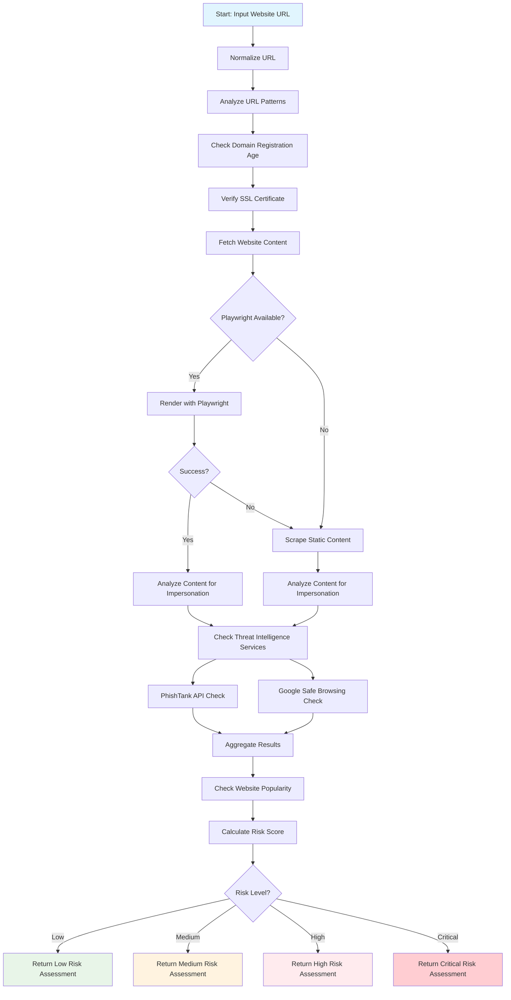

# Website Fraud Check Skill

A skill for detecting potentially fraudulent websites by analyzing various indicators including URL patterns, domain information, SSL certificates, and website content.

## Features

- 🛡️ Threat intelligence feed checking
- 📄 Static and dynamic content analysis
- 🎭 Brand impersonation detection
- 🔍 URL pattern analysis for suspicious elements
- 🔒 SSL certificate validation
- 📅 Domain age verification
- 📊 Risk scoring and assessment

## Prerequisites

### Basic Requirements
- Node.js
- Internet connectivity

### Enhanced Detection (Optional but Recommended)
For improved detection of dynamically-rendered websites (those that update HTML DOM after page load), install Playwright:

```bash
npm install --save playwright
npx playwright install chromium
```

> **Note**: With Playwright, the system can:
> - Render JavaScript-heavy websites
> - Detect content that loads dynamically
> - Identify more sophisticated phishing attempts
> - Improve impersonation detection accuracy

## Installation

1. Ensure Node.js is installed on your system
2. (Optional) Install Playwright for enhanced detection: `npm install --save playwright && npx playwright install chromium`

## Usage

This skill is designed to be used by agentic AI systems like OpenClaw. The primary interface is through the OpenClaw skill system.

When invoked by OpenClaw, the skill will analyze the provided website URL and return a comprehensive fraud risk assessment.

Example usage within OpenClaw:
```
check if [website_url] is fraudulent
is [website_url] safe to visit?
analyze [website_url] for scams
```

The skill can also be run directly:
```bash
node scripts/website_fraud_check.mjs <website_url>
```

Example:
```bash
node scripts/website_fraud_check.mjs https://example.com
```

## Risk Levels

- 🟢 **LOW (0-14)**: Appears safe, exercise normal caution
- 🟠 **MEDIUM (15-29)**: Exercise caution, verify legitimacy
- 🟡 **HIGH (30-49)**: Exercise extreme caution
- 🔴 **CRITICAL (50+)**: Do not trust, avoid entering information

## How It Works

The system evaluates websites based on multiple factors:

1. **URL Analysis**: Checks for suspicious patterns and structures
2. **Domain Age**: Uses the `whoiser` Node.js library to check domain registration age; new domains (less than 1 year) receive higher risk scores.
3. **SSL Verification**: Ensures secure connections
4. **Content Analysis**: Scans for brand impersonation and suspicious elements
   - **Static Content**: Direct HTML parsing for standard websites
   - **Dynamic Content**: Uses Playwright to render JavaScript-heavy sites before analysis
5. **Threat Intelligence**: Checks against known malicious sites
6. **Website Popularity**: Checks against Tranco popularity list to reduce risk for well-known sites



## Detection Capabilities

The skill can detect:
- Phishing websites mimicking legitimate services
- Recently registered domains
- Sites with invalid SSL certificates
- Websites containing suspicious keywords
- Impersonation of well-known brands/services
- Suspicious URL structures
- Known phishing sites from threat intelligence feeds (with API integration)

## Configuration

All configurable constants and thresholds for the fraud checking logic are centralized in `config/fraud-data.json`. This includes:
- Suspicious URL patterns
- Target brand names for impersonation detection
- Specific fraud indicators
- Lists of multi-part TLDs and suspicious TLDs
- Homoglyph and digit substitution definitions
- Risk score multipliers and age thresholds

## Threat Intelligence Integration

The skill integrates with threat intelligence services (PhishTank, Google Safe Browsing) to identify known malicious sites. API keys for enhanced services (e.g., Google Safe Browsing) should be configured as environment variables.

## Improvements (as a Cybersecurity and Fraud Specialist)

The current agent skill provides a solid foundation for detecting fraudulent websites. To further enhance its effectiveness, the following improvements are recommended:

### 1. Behavioral Analysis & Sandbox Execution
-   **Automated Interaction:** Implement logic to simulate user clicks, form submissions, and observe DOM changes over time to detect interactive fraud patterns.
-   **Headless Browser Sandboxing:** Execute suspected pages in a sandboxed headless browser environment to observe network requests, script execution, and resource loading for anomalous activities.
-   **Redirection Chain Analysis:** Explicitly trace and analyze all redirection types (HTTP, meta refresh, JavaScript) to identify suspicious intermediate domains or evasion techniques.

### 2. Advanced Impersonation Detection
-   **Visual Similarity (Perceptual Hashing):** Introduce visual comparison methods (e.g., perceptual hashing) to compare screenshots of suspected sites against known legitimate sites, enhancing detection of visual brand impersonation.
-   **Natural Language Processing (NLP):** Utilize advanced NLP models to detect subtle linguistic cues (e.g., unusual urgency, grammatical errors, specific scam terminology) often indicative of fraudulent content.

### 3. Expanded Threat Intelligence
-   **More Feeds:** Integrate with additional, diverse, and specialized threat intelligence sources (e.g., for malware, specific phishing kits, compromised domain lists from reputable cybersecurity vendors).
-   **Contextual TI:** Implement the ability to query threat intelligence specific to targeted brands or industries for more relevant threat data.

### 4. Machine Learning for Risk Scoring
-   **Dynamic Scoring:** Develop and train a machine learning model on a dataset of known fraudulent and legitimate websites to provide more nuanced, adaptive, and predictive risk scores.
-   **Feature Importance:** Leverage ML models to identify and weight the most impactful indicators in fraud detection, potentially uncovering non-obvious correlations.

### 5. Performance and Scalability
-   **WHOIS Caching:** Implement a local or distributed cache for WHOIS results to reduce redundant queries, speed up checks, and avoid rate limits imposed by WHOIS servers.
-   **Distributed Scans:** For large-scale or continuous monitoring, consider a distributed architecture for scanning to parallelize resource-intensive tasks like Playwright rendering and WHOIS lookups.

## Limitations

- May occasionally flag legitimate new sites
- Cannot detect all sophisticated social engineering tactics
